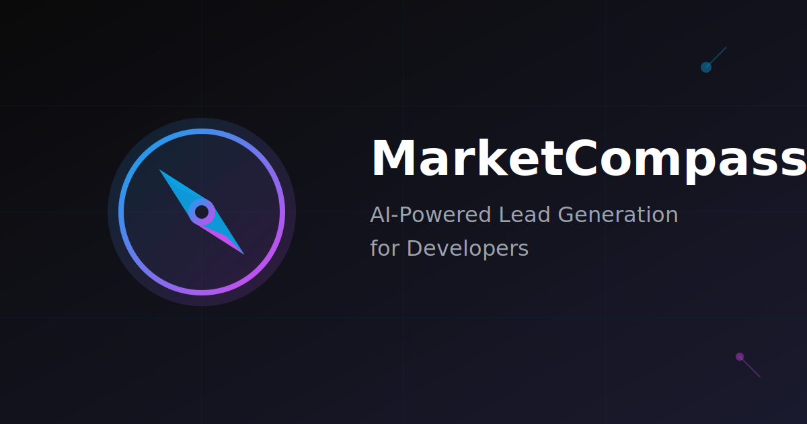

# MarketCompassZ 🧭

**AI-Powered Lead Generation for Developers & Freelancers**

> Find businesses without websites in seconds, not hours.

Built for the [GenAI Hackathon Delhi](https://www.commudle.com/communities/tensorflow-delhi/events/genai-hackathon-delhi) organized by TFUG Delhi.

---

## 🎯 What is MarketCompassZ?

MarketCompassZ eliminates hours of manual Google Maps scrolling for developers and agencies hunting for clients. Our **AI Agent powered by Google ADK and Gemini** autonomously scans cities, identifies businesses without digital presence (no websites or apps), and delivers **ready-to-pitch leads** straight to your dashboard.

### The Problem
- Freelancers waste 5-10 hours/week manually searching for potential clients
- Cold outreach has low conversion without proper targeting
- Businesses without websites are goldmines, but impossible to find at scale

### The Solution
- **AI-driven discovery**: Enter niche + city → Get qualified leads in 60 seconds
- **Real-time sync**: Leads appear on your dashboard as they're discovered
- **Smart scoring**: AI prioritizes businesses most likely to convert
- **Social verification**: Cross-references Maps data with social media activity

---

## 🚀 Live Demo

🔗 **[marketcompassz.vercel.app](https://marketcompassz.vercel.app)** _(Coming Soon)_



---

## 🏗️ Architecture

```
┌─────────────────┐
│   Next.js App   │ ← User Interface (Vercel)
│   (Frontend)    │
└────────┬────────┘
         │
         ├──────────────────────┐
         │                      │
         ▼                      ▼
┌─────────────────┐    ┌──────────────────┐
│ Firebase Auth   │    │ Google Maps API  │
│   + Firestore   │    │  (Places API)    │
└─────────────────┘    └──────────────────┘
         │                      │
         └──────────┬───────────┘
                    │
                    ▼
         ┌─────────────────────┐
         │  Google ADK Agent   │
         │   + Gemini 1.5 Pro  │
         │  (Vertex AI / API)  │
         └─────────────────────┘
```

---

## 🛠️ Tech Stack

- **AI/ML**
  - [Google Agent Development Kit (ADK)](https://github.com/google/adk) - Autonomous agent framework
  - Gemini 1.5 Pro - Large Language Model
  - Vertex AI - Google Cloud AI Platform

- **Frontend**
  - Next.js 14 (App Router)
  - React 18
  - TypeScript
  - Tailwind CSS
  - Framer Motion

- **Backend & Data**
  - Firebase Authentication (Google OAuth)
  - Cloud Firestore (Real-time database)
  - Google Maps Platform (Places API, Geocoding API)

- **Hosting & Deployment**
  - Vercel (Frontend + Serverless Functions)
  - Google Cloud Run (ADK Agent - Optional)

---

## ✨ Key Features

### 🤖 ADK-Powered Autonomous Agent
Multi-step reasoning AI that searches, filters, and scores leads without human intervention.

### ⚡ Real-Time Lead Discovery
Leads appear on your dashboard instantly as the agent discovers them.

### 🎯 Smart Lead Scoring
AI ranks businesses by conversion probability (contact info quality, social activity, niche fit).

### 🔍 Social Enrichment
Cross-references Google Maps with social media to verify business legitimacy and activity.

### 🔐 Google Authentication
One-click sign-in with your existing Google account.

### 📊 Lead Management Dashboard
Track, filter, export leads. Mark favorites, add notes, set follow-up reminders.

---

## 📦 Installation & Setup

### Prerequisites
- Node.js 18+ and npm
- Firebase project
- Google Cloud project with billing enabled
- API keys (see [API_SETUP_GUIDE.md](./API_SETUP_GUIDE.md))

### 1. Clone Repository
```bash
git clone https://github.com/aakash4dev/MarketCompassZ.git
cd MarketCompassZ
```

### 2. Install Dependencies
```bash
npm install
```

### 3. Environment Variables
Create a `.env` file (see `.env.example` for template):

```env
# Firebase
NEXT_PUBLIC_FIREBASE_API_KEY=your_firebase_api_key
NEXT_PUBLIC_FIREBASE_AUTH_DOMAIN=your-project.firebaseapp.com
NEXT_PUBLIC_FIREBASE_PROJECT_ID=your-project-id
# ... (see .env.example for complete list)

# AI
GEMINI_API_KEY=your_gemini_api_key

# Google Cloud
GOOGLE_CLOUD_PROJECT=your-project-id
VERTEX_AI_LOCATION=us-central1

# Maps
GOOGLE_MAPS_API_KEY=your_maps_api_key
```

**📚 Detailed setup guide**: [API_SETUP_GUIDE.md](./API_SETUP_GUIDE.md)

### 4. Firebase Setup
Enable these Firebase services:
- ✅ **Authentication** → Google Sign-In
- ✅ **Firestore Database** → Production mode
- ✅ **Storage** (Optional)

### 5. Run Development Server
```bash
npm run dev
```

Open [http://localhost:3000](http://localhost:3000)

---

## 🎯 Usage

1. **Sign in** with your Google account
2. **Enter search criteria**:
   - Business niche (e.g., "Plumbers", "Restaurants")
   - City or region (e.g., "New York", "Los Angeles")
3. **Let AI work**: Agent scans Google Maps autonomously
4. **View results**: Qualified leads appear on your dashboard
5. **Export & pitch**: Download leads as CSV, start outreach

---

## 📸 Screenshots

### Landing Page
Professional dark-themed landing page with hero section, lead generation form, and feature showcase.

### Dashboard
_(Coming Soon)_ Real-time lead discovery dashboard with filters and export options.

---

## 🏆 Hackathon Submission

**Event**: GenAI Hackathon Delhi  
**Organizer**: TensorFlow User Group Delhi  
**Category**: AI Agents / Productivity Tools  
**Built by**: Aakash Singh Rajput ([@aakash4dev](https://github.com/aakash4dev))

### Why This Project Stands Out
1. **Real-world problem**: Solves actual pain point for developers/agencies
2. **Google ADK integration**: Showcases autonomous agent capabilities
3. **Production-ready**: Full auth, database, and deployment pipeline
4. **Measurable impact**: Saves 5-10 hours/week per user

---

## 🗺️ Roadmap

- [x] Landing page with lead generation form
- [x] Firebase authentication (Google)
- [x] Dark theme UI with glassmorphism
- [ ] ADK agent integration
- [ ] Google Maps API integration
- [ ] Lead dashboard with real-time updates
- [ ] Lead scoring algorithm
- [ ] CSV export functionality
- [ ] Email notifications
- [ ] Subscription tiers
- [ ] Chrome extension

---

## 📄 License

Copyright (c) 2025 **Aakash Singh Rajput** ([@aakash4dev](https://github.com/aakash4dev))

Licensed under the **MIT License**.

Permission is hereby granted, free of charge, to any person obtaining a copy of this software and associated documentation files (the "Software"), to deal in the Software without restriction, including without limitation the rights to use, copy, modify, merge, publish, distribute, sublicense, and/or sell copies of the Software.

See [LICENSE](./LICENSE) file for full details.

---

## 🙏 Acknowledgments

- **Google** - For ADK, Gemini AI, and Cloud Platform
- **TensorFlow User Group Delhi** - For organizing the hackathon
- **Firebase** - For seamless backend infrastructure
- **Vercel** - For hosting and deployment

---

## 📞 Contact

**Aakash Singh Rajput**  
GitHub: [@aakash4dev](https://github.com/aakash4dev)  
Project: [MarketCompassZ](https://github.com/aakash4dev/MarketCompassZ)  
Hackathon: [GenAI Hackathon Delhi](https://www.commudle.com/communities/tensorflow-delhi/events/genai-hackathon-delhi)

---

**⭐ Star this repo** if you find it useful for the hackathon!